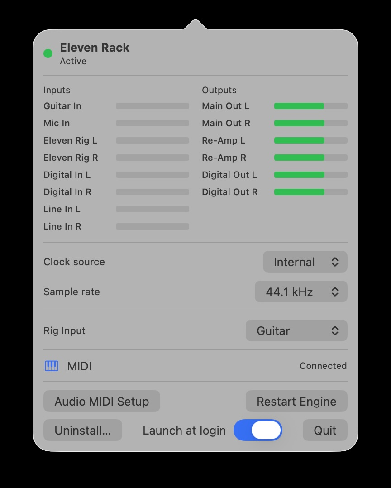

# Eleven Rack Driver — user-space audio driver for Apple Silicon

<p align="center">
  
</p>

A macOS Core Audio driver for the Avid **Eleven Rack** that runs **entirely in
user space**. There is **no kernel extension, no DriverKit system extension, and
no "Reduced Security" / Recovery change** — just a signed audio plug-in, a small
background engine, and a menu-bar app.

Your Eleven Rack appears in Audio MIDI Setup and any DAW as an **8-in / 6-out**
device at **44.1, 48, 88.2 or 96 kHz**.

| Inputs (8) | Outputs (6) |
|---|---|
| Guitar In, Mic In, Eleven Rig L/R, Line In L/R, Digital In L/R | Main Out L/R, Re-Amp L/R, Digital Out L/R |

> Apple Silicon only (arm64). macOS 13 or later.

## Install

1. Download **`ElevenRackDriver-1.1.0.pkg`** from the
   [latest release](../../releases/latest) ([all releases](../../releases)).
2. Double-click it and follow the installer. It asks for your administrator
   password once (to install the plug-in and restart the audio service) — it
   changes **no** security settings.
3. Plug in your Eleven Rack.

Because the installer is not signed with a paid Apple Developer certificate,
macOS Gatekeeper asks you to approve it **once**:

- **Right-click** the `.pkg` → **Open** → **Open** in the dialog, **or**
- if you double-clicked and were blocked, open **System Settings → Privacy &
  Security**, scroll down, and click **Open Anyway**.

That's the only extra step — no Terminal required.

## Using it

After installing, the Eleven Rack **pick** icon appears in the menu bar (it also
starts automatically at every login, and inverts for light/dark menu bars):

- **Solid pick** — active: the Eleven Rack is connected and streaming.
- **Dimmed pick** — the Eleven Rack is not connected.
- **Red pick** — the engine isn't running.

Click the icon for the control panel:

- **Live level meters** for all 8 inputs and 6 outputs.
- **Sample-rate picker** (44.1 / 48 / 88.2 / 96 kHz) — retunes the hardware to
  match; there's a brief (~60 ms) gap while the streams restart.
- **MIDI status** — the Eleven Rack's CoreMIDI endpoints.
- **Open Audio MIDI Setup**, **Restart Engine**, **Launch at login**, and
  **Uninstall…**.

<p align="center">
  
</p>

Select **Eleven Rack** as the input/output device in your DAW.

## Uninstall

Click the menu-bar icon → **Uninstall…**. It removes the driver, the login item,
and the app after a single password prompt. (Your DAW projects are untouched.)

## Notes

- Channel names show in Audio MIDI Setup and in DAWs that read Core Audio channel
  names (Logic, Reaper, Pro Tools). Some apps (GarageBand, Audacity) label inputs
  by number regardless.
- The first recording immediately after a sample-rate change may need a second or
  two to settle while the hardware clock re-locks.
- **MIDI** needs nothing from this driver: the Eleven Rack's USB-MIDI interface is
  a standard class device that macOS exposes on its own as the **Eleven Rack Rig**
  and **Eleven Rack External** ports (in and out), usable in any DAW.

---

## Architecture

```
   login ─► launchd (LaunchAgent)
              └─► Eleven Rack.app  (menu bar; supervises the engine, shows status)
                     ├─ erengine   (user-space USB engine; owns the device)
                     │      └─ shared-memory ring (float32) ◄──► coreaudiod
                     └─ reads the ring for status + meters
                                    │
   DAW / Core Audio ── coreaudiod ──► ElevenRackAudioPlugin (HAL .driver bundle)
                                    │
   Eleven Rack hardware ◄── USB (high-speed isochronous) ── erengine
```

- **`ElevenRackAudioPlugin/`** — a Core Audio `AudioServerPlugin` loaded by
  `coreaudiod`. Publishes the device/streams/channel names and exchanges float32
  audio with the engine through a lock-free shared-memory ring.
- **`ElevenRackBridge/`** — the user-space engine (`erengine.c`) that owns the USB
  device, streams isochronous audio, and bridges it to the plug-in through the
  ring (`ERAudioRing.h`). Also contains standalone diagnostic tools.
- **`ElevenRackApp/`** — the Swift menu-bar app: supervises `erengine`, shows
  status, and hosts the control panel. Reads the ring **read-only** for meters
  (via `er_*_peek_levels`) so it never disturbs the audio path.
- **`packaging/`** — the installer: LaunchAgent, `postinstall`, and
  `build_pkg.sh` which assembles the `.pkg`.

## Build from source / make a release

Requires the Xcode command-line tools (for `clang`, `swiftc`, `pkgbuild`).

Open **`Eleven Rack Driver.code-workspace`** in Visual Studio Code for a ready-to-go
setup — it sets the C11/C++17 standards and `ElevenRackBridge` include path and
recommends the Swift and C/C++ extensions. Then build the installer with:

```bash
packaging/build_pkg.sh
```

This builds and ad-hoc-signs the HAL plug-in, the USB engine, and the menu-bar
app, then produces `dist/ElevenRackDriver-<version>.pkg`.

To ship a notarized, warning-free installer, set `SIGN_ID` to a *Developer ID
Application* identity and `PKG_SIGN_ID` to a *Developer ID Installer* identity
before running the script, then notarize the output with `xcrun notarytool`.

For a quick developer install of just the plug-in + engine (no app/packaging):

```bash
./install.sh
```

## License

[MIT](LICENSE) © 2026 Matt Housley.
